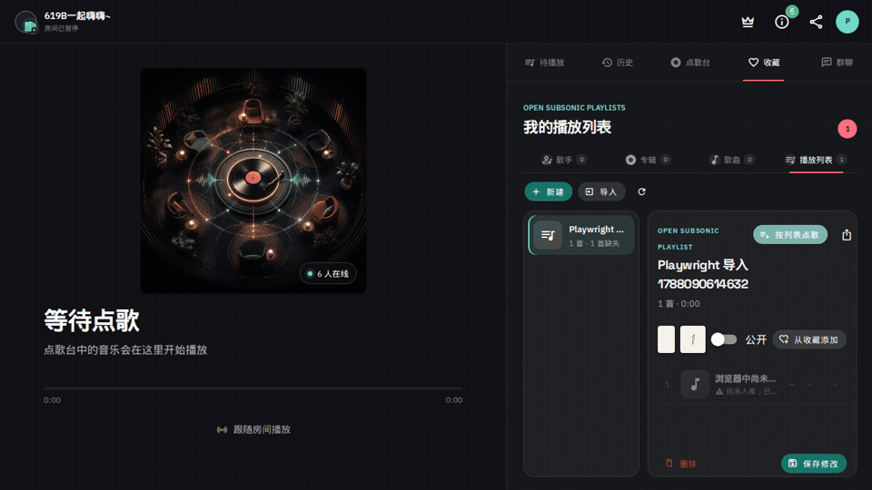

# Navidrome Music Room

[](https://github.com/mythezone/navidrome-music-room/actions/workflows/ci.yml)
[](LICENSE)
[](https://www.navidrome.org/)

[中文说明](README.zh-CN.md)

> Developer preview: the gateway, `.ndp` bridge, signed updater, contracts, and first MusicMate compatibility layer are under active development. Do not expose a development build to the public internet without reviewing the security guide.

Navidrome Music Room turns a self-hosted Navidrome library into a synchronized listening room for MusicMate. A Navidrome administrator creates a room, shares a link or QR code, and invited Navidrome users listen together. Every listener signs in with their own account and streams audio directly from Navidrome—room traffic never becomes a media proxy.



_The preview shows the existing MusicMate room layout that the Navidrome provider preserves. Chat, VIP, statistics, rankings, and achievements remain visible but License-locked._

## How it works

```text
Navidrome plugin settings
        │ JSONForms config + explicitly authorized users
        ▼
navidrome-music-room.ndp
        │ 30-second user/admin lease heartbeat
        ▼
Local Music Room Gateway ◀── REST/WebSocket ──▶ MusicMate
        ▲                                           │
        └──────── OpenSubsonic auth proof ──────────┘
                                                    │
                              audio/artwork/lyrics directly from Navidrome
```

Navidrome v0.63.2 plugins are sandboxed WebAssembly modules. They do not currently expose custom Navidrome pages, inbound HTTP/WebSocket routes, or player-control extensions, and plugins must not open a network listener. The project therefore uses a standard `.ndp` bridge plus a local companion gateway. This limitation and the architecture are documented openly in [Navidrome's plugin documentation](https://www.navidrome.org/docs/usage/features/plugins/) and [our architecture notes](docs/ARCHITECTURE.md).

The Navidrome web UI is used only to configure, authorize, enable, and disable the bridge. The complete room experience lives in MusicMate. If Navidrome later adds a supported player/UI extension point, an in-app React/Material UI panel can be added without creating a second audio player.

## Feature matrix

| Capability | Community core | Future licensed extension |
|---|---:|---:|
| Room CRUD, close/reopen | ✅ | |
| Revocable invitations and persistent membership | ✅ | |
| Presence, synchronized playback, queue, history | ✅ | |
| Navidrome search, cover art, lyrics, transcode and stream | ✅ via each user's OpenSubsonic account | |
| QR/deep-link sharing | ✅ generated locally by MusicMate | |
| Chat and stickers | 🔒 | Planned |
| VIP/paid membership | 🔒 | Planned |
| Statistics, rankings, levels and achievements | 🔒 | Planned |
| Uploads, online sources, voice requests, public output | Not included | Not scheduled |

Locked APIs consistently return HTTP `402` with `code=feature_locked` and a `featureKey`. The GPL core contains no hidden implementation that a client can bypass. Its entitlement boundary can verify an Ed25519-signed License entirely offline, but a signed claim cannot activate code that is not shipped; see [License files](docs/LICENSE_FILES.md).

## Quick start with Docker Compose

Requirements: Linux amd64/arm64, Docker Engine, Docker Compose v2, two HTTPS hostnames, and a writable plugin directory shared by Navidrome and the gateway.

```bash
git clone https://github.com/mythezone/navidrome-music-room.git
cd navidrome-music-room
cp .env.example .env
```

Edit `.env` and set at least:

```dotenv
NAVIDROME_PUBLIC_URL=https://music.example.com
MUSIC_ROOM_PUBLIC_URL=https://rooms.example.com
MUSIC_ROOM_PLUGIN_PAIRING_TOKEN=<64 random hex characters>
```

The developer preview tracks the signed `beta` container tag. Stable releases
will move the default installation channel to `latest`; pin an exact version in
production.

Then create writable directories and start both services:

```bash
mkdir -p data/navidrome data/plugins/navidrome-music-room/room-data music
chown -R 1000:1000 data
docker compose up -d
```

Alternatively, `deploy/compose/install.sh` creates the directories and a random pairing token before starting Compose. Review `.env` before exposing either service.

For a package-based host, use the same release bundle with the hardened [systemd unit and installation guide](deploy/systemd/README.md).

In Navidrome:

1. Open **Settings → Plugins → Navidrome Music Room**.
2. Set the internal and public Navidrome/gateway URLs.
3. Copy the pairing token from `.env` or `data/plugins/navidrome-music-room/room-data/secrets/plugin-pairing-token`.
4. Explicitly select allowed users (or deliberately choose all users).
5. Enable the plugin and confirm a fresh heartbeat in the gateway logs.

Put both services behind TLS. The [Nginx example](deploy/nginx.conf.example) includes WebSocket forwarding. Never publish the gateway over plain HTTP outside a trusted host.

## MusicMate flow

1. Add a Navidrome account in MusicMate. The password stays in Keychain/Credential Store.
2. MusicMate generates a random OpenSubsonic salt and `md5(password + salt)` token locally.
3. The gateway validates that proof against its configured Navidrome URL and returns a 15-minute room session. Raw passwords are never sent to or stored by the gateway.
4. A Navidrome administrator creates a room and chooses music folders they can access.
5. In MusicMate, open **Manage Navidrome Rooms**, create the room, then generate an HTTPS share link, deep link, and QR code locally. The invitation secret is in the URL fragment so it does not enter proxy logs or the `Referer` header.
6. An invited user signs in, redeems the invitation once, and receives persistent room membership.
7. Room state travels over REST/WebSocket. Media travels directly from Navidrome with the listener's own account.

Example links:

```text
https://rooms.example.com/join/ROOM_ID#invite=SECRET
musicmate://join?server=https%3A%2F%2Fmusic.example.com&gateway=https%3A%2F%2Frooms.example.com&room=ROOM_ID&invite=SECRET
```

See [MusicMate integration](docs/MUSICMATE_INTEGRATION.md) and the versioned [OpenAPI contract](contracts/openapi.yaml).

## Security and privacy

- No anonymous rooms. Every session is tied to a currently allowed Navidrome user.
- Creating rooms requires both `adminRole=true` and plugin authorization.
- The gateway accepts only its configured Navidrome internal URL; clients cannot supply an upstream URL.
- OpenSubsonic proofs stay only in memory for the 15-minute room session and are redacted from logs.
- Invitations use 256-bit random values; SQLite stores only SHA-256 digests.
- A removed/unauthorized Navidrome user fails their next request immediately.
- A plugin heartbeat older than 90 seconds blocks new sessions and room creation. Existing sessions receive a 60-second grace period.
- WebSockets use one-time, 60-second tickets instead of long-lived bearer tokens in URLs.
- Music-folder ACLs are checked at join and queue time. The room never borrows its owner's credentials.
- Updates require a signed checksum manifest, SHA-256 match, and offline Sigstore verification of the archive, SPDX SBOM, and digest-bound in-toto/SLSA provenance before staging; the launcher rechecks extracted-file digests before activation.
- No telemetry is sent by default. A Navidrome administrator can explicitly export an automatically redacted JSON diagnostic bundle from MusicMate; it contains aggregate health only.

Read [SECURITY.md](SECURITY.md) and [the threat model](docs/SECURITY_MODEL.md) before an internet-facing deployment.

## Data, backup, and uninstall

All room-owned data is separate from Navidrome's database:

```text
${Plugins.Folder}/navidrome-music-room/room-data/
├── rooms.sqlite3
├── rooms.sqlite3-wal
├── secrets/
├── backups/
├── releases/
└── logs/
```

SQLite uses WAL, foreign keys, and transactional migrations. A consistent backup is created before every schema migration and launcher switch. Sensitive files use mode `0600`; directories use `0700`.

Uninstalling the `.ndp` or container does not delete `room-data`. To remove it permanently, stop the gateway, make a final backup, and explicitly delete only the `navidrome-music-room/room-data` directory.

## Updates and rollback

The admin API supports **Check**, **Stage**, **Install**, and **Rollback**. It downloads GitHub Release bundles—never `git pull`—and verifies checksums, signed SPDX inventory, signed digest-bound provenance, safe archive paths, and required files. The stable launcher:

1. stops the old gateway cleanly;
2. creates a database backup;
3. atomically switches the gateway and `.ndp`;
4. waits for `/healthz`;
5. restores the previous binary, plugin, and database backup if startup or migration fails.

The Rollback button is enabled only when the launcher can prove that the
previous binary, plugin, and pre-activation SQLite backup belong to the same
activation. A manual rollback switches all three together and keeps a forward
recovery point until the older gateway passes health checks.

Replacing an `.ndp` disables it in Navidrome by design. MusicMate's administrator screen implements the one-click continuation: it obtains an in-memory Navidrome UI JWT, rescans, re-enables the plugin through a v0.63.2-compatible adapter, and reports success only after both the gateway and plugin-version heartbeat match. The private endpoints remain isolated behind that adapter; see [UPDATES.md](docs/UPDATES.md).

## Compatibility

| Component | Supported |
|---|---|
| Navidrome | v0.63.2 minimum; latest stable is tested in CI |
| Gateway host | Linux amd64 and arm64 |
| OpenSubsonic | `getUser`, `getMusicFolders`, `search3`, `getSong`, `getAlbum`, `stream`, `getCoverArt`, `getLyricsBySongId` |
| Deployment | Docker Compose and systemd |
| Multiple gateway replicas | Not supported in v1 |
| Existing FAIO rooms | Continue through `FAIORoomProvider`; no v1 data import |

## Troubleshooting

- **`plugin_not_paired` / `plugin_lease_expired`**: verify the pairing token, authorized-user selection, plugin enabled state, internal hostname, and gateway clock.
- **`library_access_required`**: grant the user the room's music folders in Navidrome, then exchange a new session.
- **WebSocket closes immediately**: request a new one-use ticket and confirm reverse-proxy Upgrade headers.
- **Update remains staged**: automatic activation requires the stable launcher and `MUSIC_ROOM_MANAGED_BY_LAUNCHER=true`.
- **Plugin disabled after update**: rescan and enable it in Navidrome, then wait up to 30 seconds for heartbeat.
- **No audio in gateway traffic**: that is expected; inspect the client's direct Navidrome request instead.

## Development

```bash
make test
make plugin
make build
```

The gateway is Go 1.25 with a pure-Go SQLite driver. The bridge targets WASI with TinyGo 0.41.1 and Navidrome's v0.63.2 PDK. Golden compatibility payloads live in `contracts/fixtures`.

The plugin setting `update_channel` defaults to `stable`. Selecting `beta`
allows prereleases; it does not disable checksum, Sigstore, provenance, archive,
or health verification.

Mutation clients may send an `Idempotency-Key` (8–128 URL-safe characters). Responses below HTTP 500 are retained in memory for 15 minutes; a replay returns `Idempotency-Replayed: true`, while the same key with a different payload returns `409 idempotency_key_reused`.

Please read [CONTRIBUTING.md](CONTRIBUTING.md), [ROADMAP.md](ROADMAP.md), and [CODE_OF_CONDUCT.md](CODE_OF_CONDUCT.md). Security reports must follow [SECURITY.md](SECURITY.md), not public issues.

## License

The community core is licensed under GPL-3.0-only. See [LICENSE](LICENSE) and [NOTICE](NOTICE). Future commercial functionality is designed as a separately distributed process with a versioned local interface and will receive legal review before sale.
