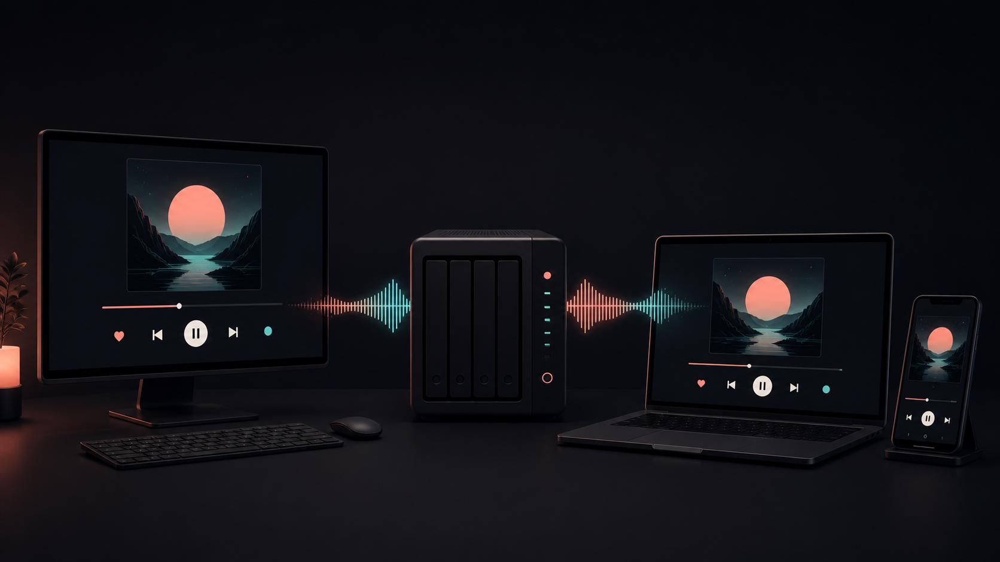
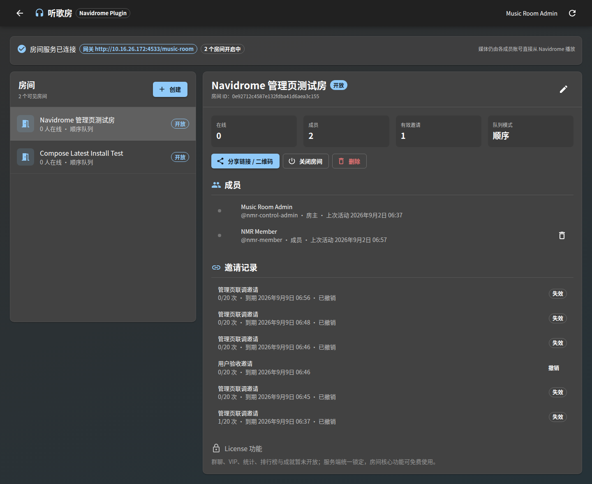
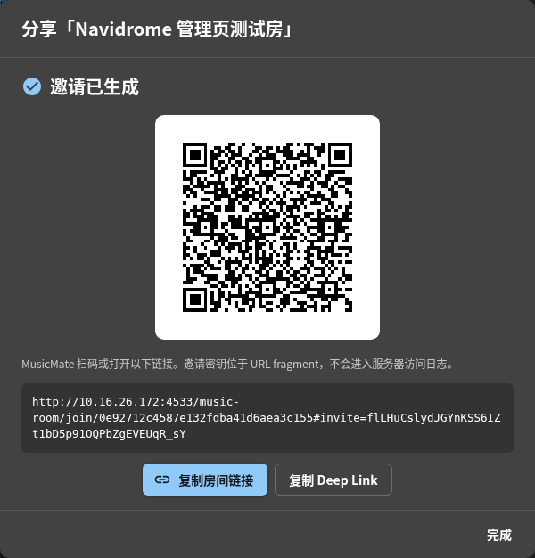

<p align="center">
  
</p>

<h1 align="center">Navidrome Music Room</h1>

<p align="center"><strong>把自己的 Navidrome 曲库变成私密、同步的一起听歌房。</strong><br />
<sub>在 Navidrome 中创建 · 分享一个链接或二维码 · 电脑和手机一起听</sub></p>

<p align="center">
  <a href="https://github.com/mythezone/navidrome-music-room/releases/tag/v1.1.0-dev"></a>
  <a href="https://github.com/mythezone/navidrome-music-room/releases"></a>
  <a href="https://github.com/mythezone/navidrome-music-room/actions/workflows/ci.yml"></a>
  <a href="https://github.com/mythezone/navidrome-music-room/actions/workflows/codeql.yml"></a>
  <a href="LICENSE"></a>
  <a href="https://www.navidrome.org/"></a>
  <a href="https://opensubsonic.netlify.app/"></a>
  
  
  <a href="CONTRIBUTING.md"></a>
</p>

<p align="center"><strong><a href="README.md">English</a> · <a href="https://github.com/mythezone/navidrome-music-room/releases">下载 v1.1.0-dev</a> · <a href="#快速安装">快速安装</a> · <a href="#使用听歌房">使用教程</a></strong></p>

<p align="center"></p>

<table>
  <tr>
    <td width="33%" align="center"><strong>① 创建房间</strong><br /><sub>管理员从插件 Website 打开管理页并创建房间。</sub></td>
    <td width="33%" align="center"><strong>② 分享邀请</strong><br /><sub>复制私密链接，或让朋友扫描本地生成的二维码。</sub></td>
    <td width="33%" align="center"><strong>③ 一起听歌</strong><br /><sub>受邀 Navidrome 用户进入同一个同步播放队列。</sub></td>
  </tr>
</table>

每个人都使用自己的 Navidrome 账号，并保持自己的曲库权限。音频直接从 Navidrome 播放，听歌房同步播放、暂停、进度、切歌、点播与断线重连。当前预览版 **v1.1.0-dev** 已补齐 **歌曲 / 专辑 / 歌手** 三种选歌方式与整张专辑点播。

## 适合这些场景

<table>
  <tr>
    <td width="25%"><strong>🌍 异地朋友</strong><br /><sub>一起听同一张专辑，所有人保持在同一秒。</sub></td>
    <td width="25%"><strong>🏠 家庭曲库</strong><br /><sub>保留各自账号与权限，不用分享管理员密码。</sub></td>
    <td width="25%"><strong>🎉 私密聚会</strong><br /><sub>成员自由点歌，房主负责全局播放控制。</sub></td>
    <td width="25%"><strong>📱 Web + App</strong><br /><sub>现在浏览器直接使用，未来可用 MusicMate 加入。</sub></td>
  </tr>
</table>

## 已实现功能

| 使用体验 | v1.1.0-dev |
|---|---|
| 创建、修改、关闭、重开和删除房间 | ✅ |
| 分享 HTTPS 邀请、MusicMate Deep Link 和本地二维码 | ✅ |
| 邀请兑换、持久成员和成员移除 | ✅ |
| 桌面与手机浏览器直接播放 | ✅ |
| 同步播放、暂停、进度、切歌和刷新重连 | ✅ |
| 按歌曲、专辑、歌手浏览并点播 | ✅ |
| 整张专辑加入待播 | ✅ |
| 搜索、收藏、歌单、封面和歌词 | ✅ |
| 每个用户按自己的权限直连 Navidrome 音频 | ✅ |
| 群聊、更丰富的房间动态和社区统计 | 开源路线图 |

## 真实界面

下面的图片由正在运行的 v1.1.0-dev 和真实 Navidrome 曲库直接生成。点歌台筛选为周杰伦，未使用虚构专辑、替换文字或模拟封面。

<p align="center">
  <br />
  <sub>按歌曲、专辑或歌手搜索 Navidrome，然后点播单曲或整张专辑。</sub>
</p>

<table>
  <tr>
    <td width="70%"></td>
    <td width="30%"></td>
  </tr>
  <tr>
    <td align="center"><sub>桌面：共同播放、待播、进度与房间在线状态</sub></td>
    <td align="center"><sub>手机：390 px 下的同一房间与曲库</sub></td>
  </tr>
</table>

<table>
  <tr>
    <td width="68%"></td>
    <td width="32%"></td>
  </tr>
  <tr>
    <td align="center"><sub>通过原生插件详情中的 Website 打开房间管理页。</sub></td>
    <td align="center"><sub>在浏览器本地生成私密链接和二维码。</sub></td>
  </tr>
</table>

## 下载

[v1.1.0-dev Release](https://github.com/mythezone/navidrome-music-room/releases/tag/v1.1.0-dev) 会直接提供无需编译的安装文件：

| 文件 | 用途 |
|---|---|
| [`navidrome-music-room-compose-1.1.0-dev.tar.gz`](https://github.com/mythezone/navidrome-music-room/releases/download/v1.1.0-dev/navidrome-music-room-compose-1.1.0-dev.tar.gz) | 推荐；可直接启动的 Navidrome + 网关 Compose 安装包 |
| [`navidrome-music-room.ndp`](https://github.com/mythezone/navidrome-music-room/releases/download/v1.1.0-dev/navidrome-music-room.ndp) | 给现有 Navidrome 使用的插件包 |
| [`navidrome-music-room-linux-amd64.tar.gz`](https://github.com/mythezone/navidrome-music-room/releases/download/v1.1.0-dev/navidrome-music-room-linux-amd64.tar.gz) | Linux x86-64 网关与 launcher |
| [`navidrome-music-room-linux-arm64.tar.gz`](https://github.com/mythezone/navidrome-music-room/releases/download/v1.1.0-dev/navidrome-music-room-linux-arm64.tar.gz) | Linux ARM64 网关与 launcher |

同一 Release 还包含校验和、SPDX SBOM、来源证明与 Sigstore 验证文件。

## 快速安装

需要 Linux amd64/arm64、Docker Engine、Docker Compose v2，以及可写的 Navidrome 数据、音乐和插件目录。

```bash
curl -LO https://github.com/mythezone/navidrome-music-room/releases/download/v1.1.0-dev/navidrome-music-room-compose-1.1.0-dev.tar.gz
tar -xzf navidrome-music-room-compose-1.1.0-dev.tar.gz
cd navidrome-music-room-1.1.0-dev
cp .env.example .env
```

编辑 `.env`。例如在局域网 `192.168.1.20:1970` 测试：

```dotenv
PUID=1000
PGID=1000
NAVIDROME_BIND_ADDRESS=0.0.0.0
NAVIDROME_PORT=1970
NAVIDROME_PUBLIC_URL=http://192.168.1.20:1970
MUSIC_ROOM_PUBLIC_URL=http://192.168.1.20:1970/music-room
MUSIC_ROOM_ALLOWED_ORIGINS=http://192.168.1.20:1970
MUSIC_LIBRARY_PATH=/srv/music
NAVIDROME_DATA_PATH=/srv/navidrome/data
NAVIDROME_PLUGINS_PATH=/srv/navidrome/plugins
MUSIC_ROOM_PLUGIN_PAIRING_TOKEN=replace-with-at-least-32-random-characters
```

请填写所有听众实际访问的 IP 或域名。局域网测试可使用 HTTP；暴露到公网前应使用同一个 HTTPS 域名。

启动：

```bash
./install.sh "$PWD"
docker compose ps
```

如果没有配置配对密钥，安装脚本会自动生成。网关 launcher 会把 `navidrome-music-room.ndp` 自动复制到共享插件目录。打开 `http://192.168.1.20:1970`，创建第一个 Navidrome 管理员，并等待音乐扫描完成。

### 使用已有的 Navidrome 曲库

先备份 Navidrome，停止原来的容器，然后让 Release 安装包继续使用原目录：

```dotenv
NAVIDROME_DATA_PATH=/现有/navidrome-data
MUSIC_LIBRARY_PATH=/现有/music
NAVIDROME_PLUGINS_PATH=/现有/navidrome-plugins
```

Compose 会把它们分别挂载为 `/data`、`/music` 和 `/plugins`，不会导入或改写 Navidrome 数据库。房间数据会独立保存在：

```text
/现有/navidrome-plugins/navidrome-music-room/room-data/
```

如果要接入自己维护的 Compose，请从 Release 包复制 `music-room-gateway` 服务和 `/music-room/` 反向代理规则，并为 Navidrome 增加：

```yaml
environment:
  ND_PLUGINS_ENABLED: "true"
  ND_PLUGINS_FOLDER: /plugins
  ND_PLUGINS_AUTORELOAD: "true"
volumes:
  - /现有/navidrome-plugins:/plugins
```

`.ndp` 本身不能监听浏览器和 WebSocket 请求，因此仍需要同机网关；推荐直接使用 Compose 安装包。

## 在 Navidrome 中配置插件

1. 打开 **设置 → 插件 → Navidrome Music Room**。
2. Compose 安装把 **Navidrome 内部地址** 设为 `http://navidrome:4533`。
3. **Navidrome 外部地址** 填听众使用的地址，例如 `https://music.example.com`。
4. **网关内部地址** 填 `http://music-room-gateway:4534`。
5. **网关外部地址** 填 `https://music.example.com/music-room`。
6. 粘贴 `install.sh` 输出或 `.env` 中的配对密钥。
7. 选择允许使用听歌房的 Navidrome 用户，保存并启用插件。
8. 等待最多 30 秒，然后点击插件的 **Website** 打开房间管理页。

网关与 Navidrome 最好使用同一个公开来源：Navidrome 在 `/`，房间在 `/music-room/`。这样浏览器可以正常登录和直连音频，不需要放宽跨域凭据规则。

## 使用听歌房

### 创建和分享

1. 以管理员身份登录 Navidrome。
2. 打开 Music Room 插件，点击 **Website**。
3. 创建房间，选择允许使用的音乐库并保存。
4. 创建邀请，选择复制链接、二维码或 MusicMate 链接。
5. 对方打开链接，使用自己的 Navidrome 账号登录并兑换邀请。

### 按歌曲、专辑和歌手点歌

在房间内打开 **点歌台**，即可切换三种选歌方式：

- **歌曲**：从 Navidrome 读取可用歌曲，点击即可点播。
- **专辑**：显示最新专辑；进入专辑后逐首选择，或点击 **整张点播**。
- **歌手**：使用 Navidrome 的歌手索引，再进入该歌手的专辑和歌曲。
- **搜索**：同时返回歌曲、专辑和歌手，仍可用上面的三个标签切换。

这些页面直接使用标准 OpenSubsonic 方法（`getRandomSongs`、`getAlbumList2`、`getArtists`、`getArtist`、`getAlbum`、`search3`）。听歌房只把 Navidrome 曲目 ID 加入共同队列，不重复维护或抓取 Navidrome 数据库。

### 同步收听

受浏览器自动播放规则限制，每个浏览器首次进入时需要点击一次 **开始收听**。之后由房主或 Navidrome 管理员控制全房间播放、暂停、进度和切歌；各客户端根据网关的权威时间计算位置、修复漂移、预载下一首，并在刷新或断网后恢复最新快照。

## 能否在 Navidrome 原生歌曲或专辑页添加按钮？

Navidrome v0.63.2 的官方 `.ndp` API 暂时做不到。当前插件 manifest 可以提供配置和 Website 链接，但没有歌曲/专辑上下文操作、自定义路由、左侧栏或播放器控制扩展点。现在强行加入原生“点播到房间”按钮，只能修改 Navidrome 前端或注入浏览器脚本，后续升级会很脆弱。

本项目继续兼容原版 Navidrome：在内嵌听歌房里复用同一套 OpenSubsonic 查询，自己提供歌曲、专辑、歌手入口。以后官方加入资源操作扩展点时，可以直接补原生按钮，而无需修改房间协议。参见 [Navidrome 官方插件文档](https://www.navidrome.org/docs/usage/features/plugins/)。

## 账号、权限与隐私

- 不允许匿名加入；每位听众都必须是插件授权的 Navidrome 用户。
- 只有 Navidrome 管理员能创建房间；房主和管理员管理全局播放与成员。
- 邀请密钥随机生成，SQLite 只保存 SHA-256 摘要。
- 加入和点歌都会检查 music folder 权限，不会借用房主权限。
- 密码只发送到同源 Navidrome 登录接口；网关拿到的是短期 OpenSubsonic 证明，不是原始密码。
- 音频、封面和歌词由各客户端直接请求 Navidrome，房间网关不代理媒体正文。
- 默认不发送遥测。

公网部署前请阅读 [SECURITY.md](SECURITY.md)。

## 数据、备份与卸载

所有房间数据都在 Navidrome 数据库之外：

```text
${Plugins.Folder}/navidrome-music-room/room-data/
├── rooms.sqlite3
├── secrets/
├── backups/
├── releases/
└── logs/
```

请把这个目录与 Navidrome 一起备份。删除容器或 `.ndp` 默认保留房间数据；只有确定永久卸载时，停止网关并精确删除这个目录。

## 更新与排错

在管理员控制台点击 **检查更新 → 立即升级**。签名更新器会下载与架构匹配的 Release 包；Launcher 先备份房间数据，再同时切换网关与 `.ndp`，健康检查失败时自动恢复上一版。手动或离线升级请按[更新文档](docs/UPDATES.md)操作，不要只替换 `.ndp`。

- **插件列表里没有插件：**确认 `ND_PLUGINS_ENABLED=true`、`/plugins` 挂载正确，并且目录中存在 `navidrome-music-room.ndp`，然后重新扫描插件。
- **插件租约过期：**检查网关内部地址、配对密钥、启用状态和用户授权，等待一个心跳周期。
- **看不到歌曲或专辑：**升级到 v1.1.0-dev，确认房间 music folder 权限，然后重新打开点歌台。
- **浏览器没有声音：**先点击一次 **开始收听**，再检查浏览器对 Navidrome `stream` 的直连请求。
- **WebSocket 断开：**检查反向代理是否为 `/music-room/` 转发 `Upgrade` 与 `Connection`。

更多说明：[兼容版本](docs/COMPATIBILITY.md)、[更新](docs/UPDATES.md)、[MusicMate 对接](docs/MUSICMATE_INTEGRATION.md)和 [API 协议](contracts/openapi.yaml)。

## MusicMate App 预告

MusicMate 是接下来发布的 iOS / Android 原生客户端。它会扫描同一个房间二维码，把 Navidrome 凭据保存在系统凭据存储中，以 Navidrome 作为音源，并与 Web 用户加入同一个同步待播队列。下面已经确认的图稿会作为下一版 App 图标的标准源文件。没有 App 时，Web 听歌房仍然可以完整使用。

<table>
  <tr>
    <td width="24%" align="center"><br /><sub>下一版 App 图标</sub></td>
    <td width="76%"><strong>接下来：MusicMate 原生客户端</strong><br /><br />扫描房间二维码，以 Navidrome 作为音源，把凭据保存在系统钥匙串中，并从 iOS 或 Android 加入与 Web 相同的待播队列。<br /><br /><sub>下一版真实设备构建完成后，再在这里加入 App 实机截图。</sub></td>
  </tr>
</table>

## 欢迎合作

项目完全开源，欢迎产品接入、社区合作、代码、翻译、测试、界面建议和不同部署环境的反馈。

**联系方式：**[mythezone@gmail.com](mailto:mythezone@gmail.com)

- Bug 与功能建议：[GitHub Issues](https://github.com/mythezone/navidrome-music-room/issues)
- 提交代码：先阅读 [CONTRIBUTING.md](CONTRIBUTING.md) 和 [CODE_OF_CONDUCT.md](CODE_OF_CONDUCT.md)
- 安全问题：按 [SECURITY.md](SECURITY.md) 使用 GitHub 私密漏洞报告

项目采用 GPL-3.0-only，详见 [LICENSE](LICENSE) 和 [NOTICE](NOTICE)。
