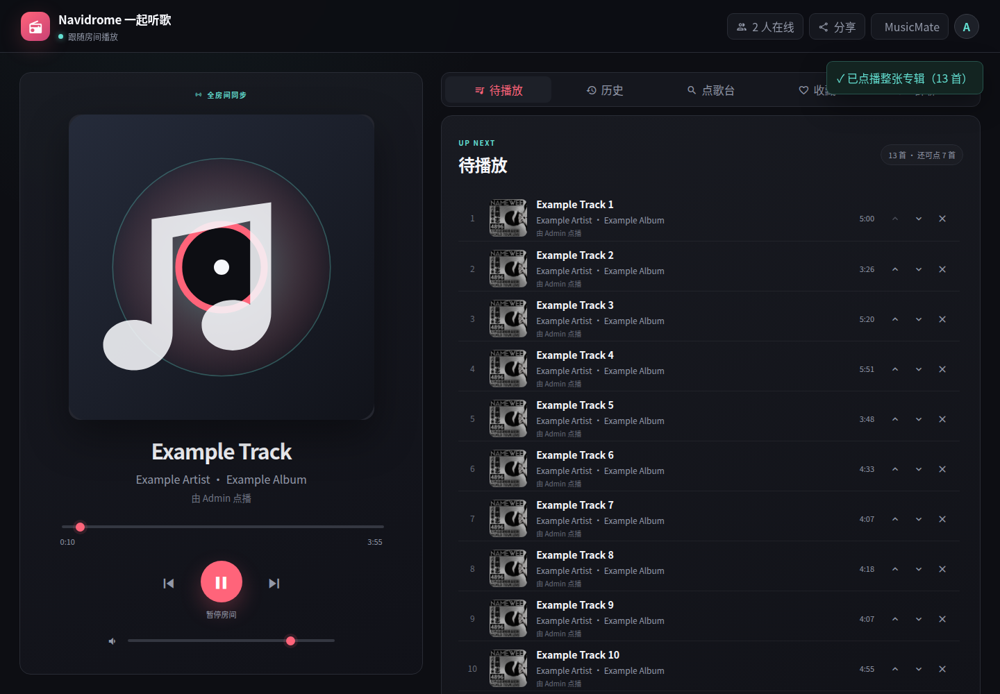
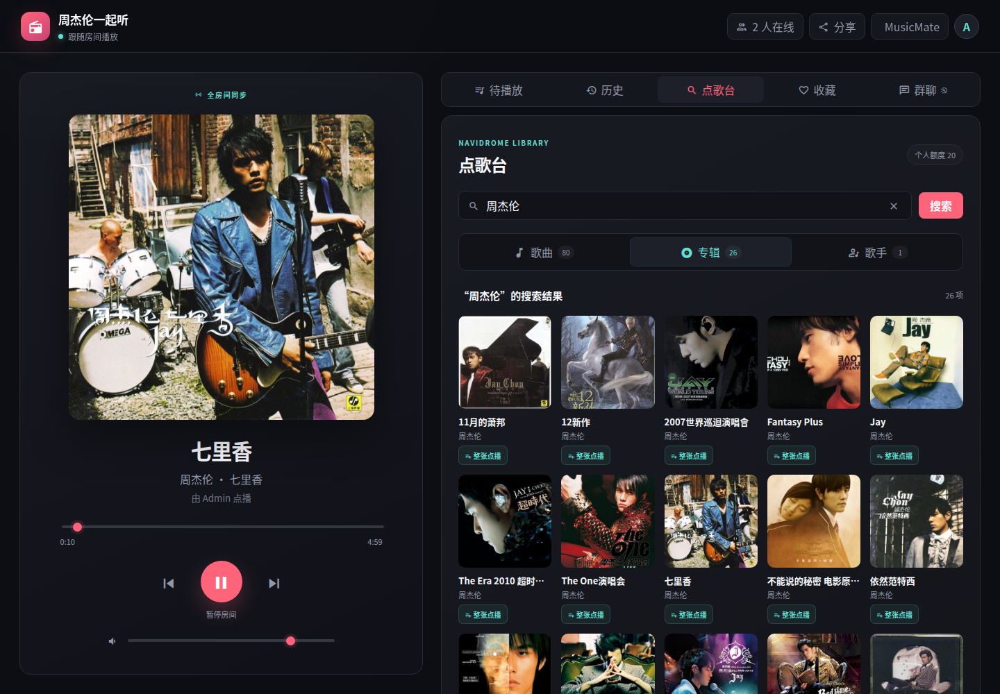
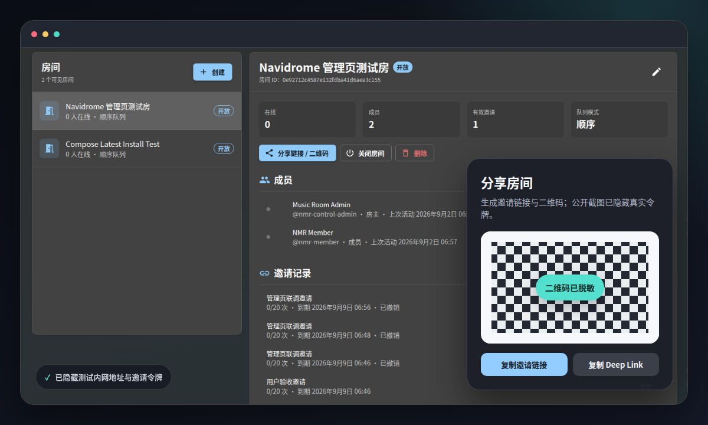
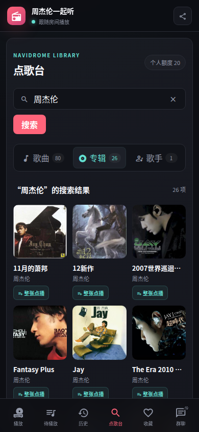

# 我们把 Navidrome 变成了一个可以一起听歌的房间

> 一个管理员创建房间、一条链接邀请朋友、每个人继续使用自己账号和曲库权限的开源一起听方案。首个公开开发版 `v1.1.0-dev` 现已可以下载测试。

有一种听歌场景一直有点别扭：歌都认真整理在自己的服务器里，朋友也想一起听，但大家只能在聊天框里倒数“3、2、1，播放”。有人卡了一下、刷新了一次，进度就又散了。

我们原来已经在 FAIO 里做过一起听歌房。最近，我们把这套能力重新整理成了一个独立开源项目：**Navidrome Music Room**。

管理员从 Navidrome 的插件页面进入管理界面，创建一间房，生成邀请链接或二维码；朋友打开链接，用自己的 Navidrome 账号登录，就能在电脑或手机浏览器里加入。房主负责播放、暂停、seek 和切歌，成员可以在共同队列里点歌。



*真实运行界面：左侧是当前播放，右侧是共同待播队列。*

## 它适合哪些时刻？

我们最先想到的是异地朋友一起重听一张老专辑，也可以是家庭成员共享家里的音乐库，或小型聚会里让大家轮流点歌。

它并不要求所有人共用管理员密码。每位听众仍然使用自己的 Navidrome 用户，能看见和播放什么，继续由原来的音乐目录权限决定。分享出去的是一间房，不是整台服务器的钥匙。

## Navidrome 是什么？

[Navidrome](https://www.navidrome.org/about/) 是一个开源、自托管的音乐服务器。你把自己的音乐目录交给它扫描，就可以通过 Web 播放器或兼容客户端浏览、搜索和播放这套曲库。

它还兼容 Subsonic 生态；官方文档当前说明其接口兼容 Subsonic API 1.16.1。对我们来说，这一点很重要：搜索、专辑、歌手、封面、歌词和音频流不需要重新发明，Music Room 只需复用这些成熟的曲库接口。[Navidrome Subsonic API 文档](https://www.navidrome.org/docs/developers/subsonic-api/)



*点歌台直接读取 Navidrome 曲库：可以在歌曲、专辑和歌手之间切换，也可以整张专辑加入队列。*

## 从安装到第一间房

当前是第一个公开开发版本 `v1.1.0-dev`。如果想从零开始体验，最简单的方式是下载 Release 中已经打包好的 Docker Compose 套件：

```bash
curl -LO https://github.com/mythezone/navidrome-music-room/releases/download/v1.1.0-dev/navidrome-music-room-compose-1.1.0-dev.tar.gz
tar -xzf navidrome-music-room-compose-1.1.0-dev.tar.gz
cd navidrome-music-room-1.1.0-dev
cp .env.example .env
```

在 `.env` 中填入监听地址、公开访问地址和宿主机目录。下面以局域网地址 `192.168.1.20:1970` 为例；`MUSIC_LIBRARY_PATH` 要换成你自己的音乐目录，配对令牌也要使用足够长的随机字符串。

```dotenv
NAVIDROME_BIND_ADDRESS=0.0.0.0
NAVIDROME_PORT=1970
NAVIDROME_PUBLIC_URL=http://192.168.1.20:1970
MUSIC_ROOM_PUBLIC_URL=http://192.168.1.20:1970/music-room
MUSIC_LIBRARY_PATH=/srv/music
NAVIDROME_DATA_PATH=/srv/navidrome/data
NAVIDROME_PLUGINS_PATH=/srv/navidrome/plugins
MUSIC_ROOM_PLUGIN_PAIRING_TOKEN=use-a-random-token-of-at-least-32-characters
```

然后运行：

```bash
./install.sh "$PWD"
docker compose ps
```

第一次打开 Navidrome 时先创建管理员，并等待音乐扫描完成。接着进入 **Settings → Plugins → Navidrome Music Room**，完成地址、配对令牌和授权用户配置，启用插件，再点击插件的 **Website** 链接。

在房间管理页里创建房间、选择音乐目录并生成邀请。对方打开链接后，用自己的 Navidrome 账号登录并兑换邀请，浏览器会进入同一个听歌房。



*管理员可以创建、关闭和管理房间，查看成员与邀请；分享弹窗会生成链接和二维码。*

如果你已经运行了 Navidrome，可以只下载 `.ndp`、网关与反向代理配置。我们更推荐先按 Release 中的 Compose 示例对照安装，因为浏览器房间还需要同源的 `/music-room/` 网关路由。完整命令、现有曲库迁移方式和回滚说明都在 [v1.1.0-dev Release](https://github.com/mythezone/navidrome-music-room/releases/tag/v1.1.0-dev) 里。

## 为什么还有一个伴生网关？

Navidrome 的插件是运行在沙箱中的 WebAssembly 模块，并通过显式权限访问用户、调度器、HTTP 和键值存储等能力。这样的边界很适合做授权同步，但官方当前的 `.ndp` 扩展点并不能承载听歌房需要的浏览器入站页面和 WebSocket 路由。[Navidrome 插件文档](https://www.navidrome.org/docs/usage/features/plugins/)

所以我们采用了“插件 + 本地伴生网关”的结构：

1. `.ndp` 插件负责同步 Navidrome 授权用户、管理员身份和租约心跳。
2. Go 网关提供房间、邀请、成员、队列、播放状态和 WebSocket 实时事件。
3. React + Material UI 的管理界面从插件 `Website` 入口打开。
4. Vue + Pinia 的 Web 听歌房负责桌面与手机端播放体验。

我们没有让网关代理音频。房间事件只携带 Navidrome 曲目 ID；每个浏览器用自己的登录状态，直接向 Navidrome 请求音频、封面和歌词。这样既避免多绕一跳，也不会借用房主账号绕过曲库 ACL。

播放同步使用服务端权威时间戳和递增 revision。播放、暂停、seek、切歌或重排队列都会形成新的房间状态；客户端刷新或断线重连后先恢复最新快照，再根据服务器时间计算当前位置。浏览器自动播放策略仍然要求每个人首次进入时点击一次“开始听歌”，这也是界面上保留显式按钮的原因。

房间、成员、邀请、队列和历史记录保存在插件目录下的独立 SQLite 数据库中，不创建或修改 Navidrome 数据表。备份或卸载时，两边的数据边界也更容易看清。

## 现在已经做到哪里？

`v1.1.0-dev` 已完成真实浏览器双客户端、桌面与 390 px 手机布局、刷新重连、不同用户曲库 ACL 隔离，以及实际音频 Range 请求测试。歌曲、专辑、歌手浏览和整张专辑点播也已经接入。

当前还不能把“点播到房间”原生插进 Navidrome 的歌曲或专辑页面，也不能直接往它的左侧栏添加入口，因为官方插件接口还没有对应扩展点。我们没有用前端注入去绕过它，而是把完整点歌台放在房间 Web 界面中，继续使用同一套 OpenSubsonic 数据。



*分享链接可以直接在手机浏览器里打开；未来的 MusicMate App 也会连接同一种房间协议。*

接下来，我们会继续打磨安装体验、浏览器兼容性和房间功能，也会推进 MusicMate App 对 Navidrome 房间链接的支持。后续工作会继续在公开仓库中推进。

## 欢迎来跑一遍真实链路

GitHub 仓库：**[mythezone/navidrome-music-room](https://github.com/mythezone/navidrome-music-room)**

如果你正在使用 Navidrome，欢迎下载 `v1.1.0-dev`，在自己的曲库和网络环境里创建一间房。能否顺利安装、反向代理是否清楚、不同浏览器是否同步、哪些交互还不自然——这些反馈对第一个稳定版本都很重要。

喜欢这个方向，可以顺手点一个 Star；发现问题请提交 Issue，有明确修复或新适配也非常欢迎 PR。合作与交流可以联系 `mythezone@gmail.com`。

我们会认真回复每一条可复现的问题和修改建议，也期待这个项目能被更多 Navidrome 用户一起做得更好。

---

资料：

- [Navidrome 官方介绍](https://www.navidrome.org/about/)
- [Navidrome 插件文档](https://www.navidrome.org/docs/usage/features/plugins/)
- [Navidrome Subsonic API 文档](https://www.navidrome.org/docs/developers/subsonic-api/)
- [Navidrome Music Room v1.1.0-dev](https://github.com/mythezone/navidrome-music-room/releases/tag/v1.1.0-dev)
